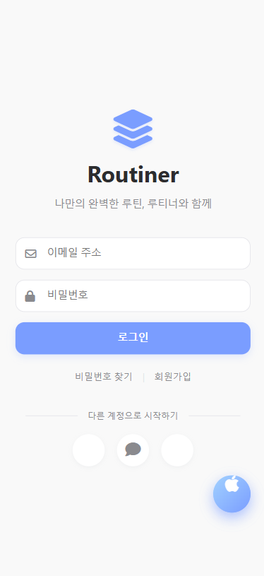
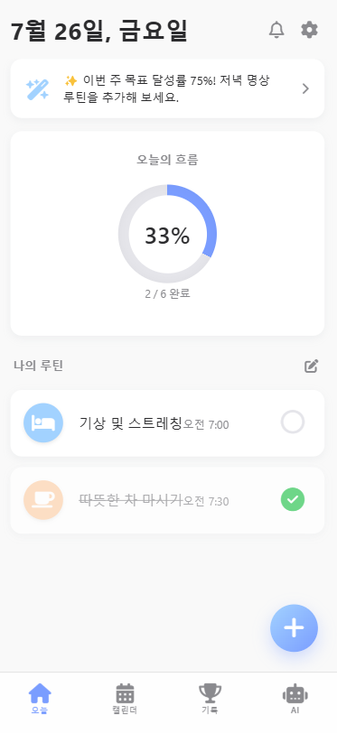
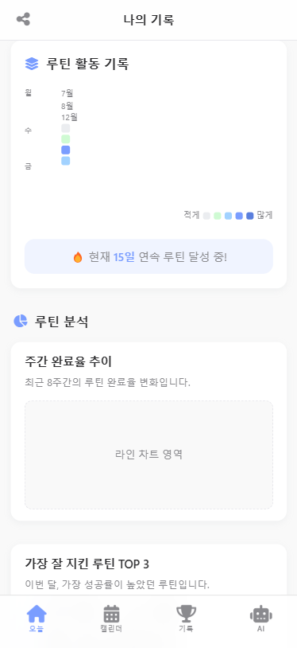
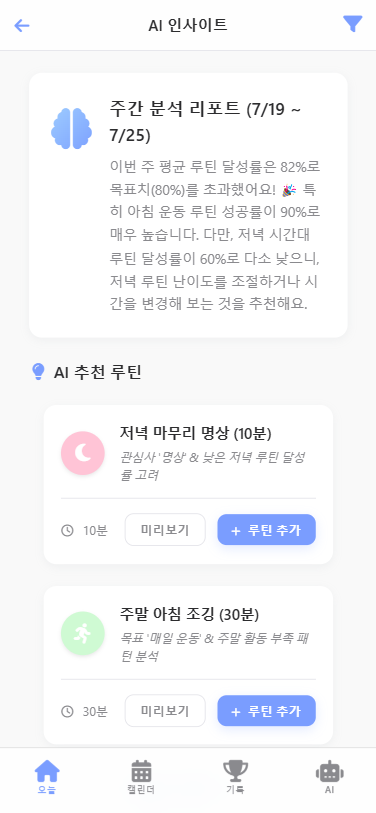

# ✨ 루티너 (Routiner) - AI 기반 루틴 관리 웹 앱

매일의 루틴을 관리하고 건강한 습관 형성을 돕는 모던하고 직관적인 모바일 중심 웹 애플리케이션 디자인 프로토타입입니다. AI 연동을 통해 사용자에게 맞춤형 루틴 추천 및 동기 부여를 제공하는 것을 목표로 합니다.

> **"정말 힘든 루틴 만들기, 루티너가 같이 해줄게요."**  
> 루티너는 데일리 루틴 관리부터 목표를 이루기 위한 루틴 추천 및 인사이트 제공까지 도와주는 서비스입니다. 사용자의 관심사, 목표, 성격 등부터 매주 고정일정과 캘린더의 일정까지 다양한 정보를 반영해서 AI를 이용한 루틴을 제공합니다.

_(현재는 HTML과 CSS를 사용한 시각적 디자인 프로토타입 단계이며, 기능적인 상호작용은 구현되어 있지 않습니다.)_

<div align="center">
    <table>
        <tr>
            <td></td>
            <td></td>
            <td></td>
            <td></td>
        </tr>
    </table>
</div>

_(👆 실제 앱 스크린샷으로 교체 예정)_

**🌐 [GitHub Pages 데모 사이트](https://routinerai.github.io/)** _(프로토타입 UI를 직접 확인해보세요!)_

## 📄 추가 문서

**[개발 문서 보기](./devdocs.md)** _(프로젝트 개요, 기능, 디자인 시스템 등 상세 내용)_

**[로고 컨셉 보기](./logoConcept.md)** _(앱 로고 디자인 컨셉 상세 내용)_

---

## 🌟 주요 기능 (구현 목표)

-   **사용자 인증:** 로그인, 소셜 로그인, 회원가입 (프로필 사진, 이메일, 아이디, 비밀번호, 이름, 전화번호 등), 비밀번호 찾기
-   **AI 맞춤 설정:** 관심사, 목표, 성향, 고정 일정, 캘린더 연동 등 AI 추천 기반 정보 입력
-   **루틴 관리:**
    -   **생성:** 아이콘/색상 선택, 이름, 시간, 반복 요일, 카테고리, 리마인더, 메모 설정, AI 적합도 검사
    -   **조회:** 오늘의 루틴, 캘린더 연동 보기, 루틴 목록 (UI 구현됨)
    -   **실행:** 루틴 완료/미완료 토글
    -   **편집/삭제:** (향후 구현)
-   **캘린더:** 월별 보기, 루틴 및 연동된 일정 시각적 표시
-   **AI:**
    -   메인 화면 인사이트 스니펫 제공
    -   AI 분석 리포트 페이지 (주간 분석 등)
    -   개인화된 루틴 추천 (카드 형태, 추가 기능)
-   **기록 (도감):**
    -   활동 히트맵 (GitHub 잔디 스타일)
    -   루틴 분석 (주간 완료율 추이, Top 루틴, 시간대별 성공률 - 차트/리스트)
    -   도전과제 갤러리 (배지 형태, 달성 여부 표시)
-   **설정:**
    -   프로필 관리 (사진, 이름, 이메일)
    -   계정 (비밀번호 변경, 연결 계정 관리)
    -   화면 (폰트 크기)
    -   알림 (리마인더, AI 알림, 도전과제 알림 - 토글/상세 설정 링크)
    -   데이터 및 연동 (캘린더 연동 관리)
    -   정보 및 지원 (버전, 약관, 문의)
    -   로그아웃, 계정 삭제

## 🎨 디자인 컨셉

-   **모던 & 깔끔함:** 불필요한 요소를 최소화하고 충분한 여백을 활용하여 콘텐츠 집중도 향상.
-   **iOS 스타일:** 부드러운 곡선, 시스템 폰트 우선 사용, 섬세한 그림자 효과, 직관적 네비게이션 적용.
-   **파스텔톤 & 시각화:** 부드러운 파스텔 색상으로 편안하고 긍정적인 분위기 조성, 아이콘과 그래픽(차트, 히트맵)으로 정보 시각화.
-   **사용자 편의성:** 쉬운 완료 토글, 명확한 정보 계층 구조, 직관적인 탭 바 네비게이션 제공.

## 🛠️ 기술 스택 (현재 및 예정)

-   **프론트엔드 (현재 - 프로토타입):**
    -   `HTML5`
    -   `CSS3` (Flexbox, Grid, CSS Variables, Animations/Transitions)
    -   `Font Awesome` (아이콘)
-   **프론트엔드 (예정):**
    -   `TypeScript` + `Next.js`: 동적 기능 구현, 상태 관리, API 연동, 서버 사이드 렌더링 활용
-   **백엔드 (예정):**
    -   `Python` (프레임워크: Django, Flask 등): 사용자 인증, 데이터 관리, API 서버 구축, AI 로직 처리
-   **데이터베이스 (예정):**
    -   `MySQL`: 사용자 정보, 루틴 데이터 등 관계형 데이터 저장
-   **AI (예정):**
    -   외부 AI 서비스 API 연동 (추천, 분석 등) 또는 자체 모델 활용 (Python 라이브러리)
-   **기타 (예정):**
    -   `Chart.js` 또는 유사 라이브러리 (데이터 시각화)

## 🚀 시작하기 (현재 프로토타입)

이 프로젝트는 현재 HTML과 CSS로 구성된 디자인 프로토타입입니다. 아래 방법으로 UI를 확인할 수 있습니다.

1.  **데모 사이트 방문 (권장):**

    -   🌐 **[GitHub Pages 데모 사이트](https://routinerai.github.io/)** 에서 직접 UI를 확인하세요.

2.  **로컬에서 실행:**
    -   이 저장소를 클론하거나 다운로드합니다.
    ```bash
    git clone https://github.com/RoutinerAI/RoutinerAI.github.io.git
    ```
    _(실제 저장소 주소로 변경 필요)_
    -   프로젝트 폴더로 이동합니다.
    ```bash
    cd RoutinerAI.github.io
    ```
    -   `index.html` 또는 각 기능별 HTML 파일(`login.html`, `signup.html` 등)을 웹 브라우저에서 엽니다. (VS Code의 `Live Server` 확장 프로그램 사용 권장)

## 💡 향후 개발 계획 (주요 항목)

-   [ ] **프론트엔드 인터랙션 구현 (TS + Next.js):**
    -   모든 페이지 라우팅 및 상태 관리 설정
    -   폼 유효성 검사 및 제출 로직 구현
    -   루틴 완료 토글, 루틴 추가/수정/삭제 기능 구현
    -   동적 데이터 렌더링 (캘린더, 히트맵, 목록, 차트 등)
-   [ ] **백엔드 개발 (Python + MySQL):**
    -   API 엔드포인트 설계 및 구현 (사용자, 루틴, AI 등)
    -   데이터베이스 모델링 및 연동
    -   사용자 인증 시스템 (JWT 또는 세션 기반) 구현
-   [ ] **AI 기능 연동:**
    -   AI 추천 로직 개발 또는 외부 API 연동
    -   사용자 데이터 기반 분석 로직 구현 및 API 연동
-   [ ] **사용자 설정 기능 구현:**
    -   알림 시스템 (프론트/백 연동)
    -   폰트 크기 조절 기능
-   [ ] **UI/UX 개선:**
    -   부드러운 페이지 전환 및 요소 애니메이션 추가
    -   사용성 테스트 및 피드백 기반 개선

## 기여하기

Pull Request는 언제나 환영합니다! 큰 변경 사항이 있다면, 먼저 이슈를 열어 논의해주시면 감사하겠습니다.

1.  저장소를 Fork 하세요.
2.  새로운 브랜치를 생성하세요 (`git checkout -b feature/AmazingFeature`).
3.  변경 사항을 커밋하세요 (`git commit -m 'Add some AmazingFeature'`).
4.  브랜치에 푸시하세요 (`git push origin feature/AmazingFeature`).
5.  Pull Request를 열어주세요.

---

이 README 파일이 "루티너" 프로젝트를 이해하는 데 도움이 되기를 바랍니다!
