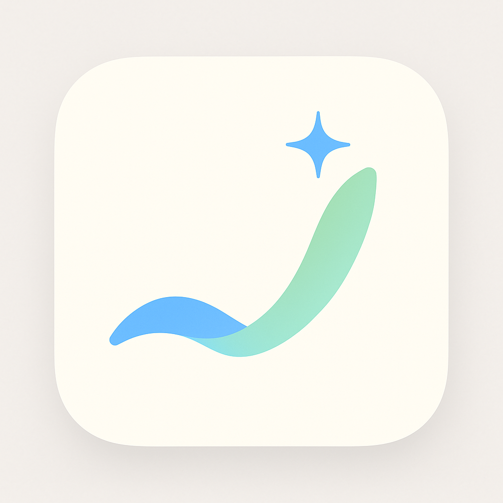

**핵심 키워드:** 흐름(Flow), 연속성, 성장, 조력(AI), 체크, 목표, 깔끔함, 파스텔

**로고 디자인 컨셉 제안:**

**컨셉 1: 흐름과 성장의 융합 (Flowing Growth)**

    

-   **형태:** 부드럽게 이어지는 곡선 두 개가 위쪽을 향해 나아가는 모습. 아래쪽 곡선은 안정적인 루틴의 기반을, 위쪽 곡선은 성장과 목표 달성을 상징합니다. 두 곡선이 만나는 지점이나 끝부분에 작은 반짝임(✨) 또는 점을 추가하여 AI의 조력과 인사이트를 표현합니다.
-   **색상:** 아래 곡선은 차분한 파스텔 블루 (`#A2D2FF`), 위 곡선은 희망적인 파스텔 그린 (`#CFFAD3`) 또는 코랄 (`#FFC4D6`). 반짝임/점은 강조색 (`#7A9DFF`) 또는 흰색. 부드러운 그라데이션을 활용하여 색상이 자연스럽게 전환되도록 할 수도 있습니다.
-   **느낌:** 유기적이고 긍정적이며, 루틴을 통해 발전하는 과정을 시각화합니다. 현대적이고 부드러운 인상을 줍니다.

**컨셉 2: 지능적인 체크마크 (Intelligent Check)**

-   **형태:** 깔끔하고 굵은 체크마크(✓)를 기본 형태로 사용합니다. 체크마크의 한쪽 끝부분이나 중심에 작은 AI 칩 모양의 패턴(예: 단순화된 뇌 모양 라인, 작은 점들의 연결) 또는 작은 별 모양을 미니멀하게 결합합니다.
-   **색상:** 체크마크는 신뢰감을 주는 액센트 블루 (`#7A9DFF`). AI 패턴/별은 흰색 또는 밝은 파스텔 옐로우 (`#FFFACD`)로 포인트를 줍니다. 배경은 흰색 또는 매우 연한 파스텔톤.
-   **느낌:** 루틴 완료(체크)라는 핵심 기능과 AI의 스마트함을 직관적으로 결합합니다. 명확하고 신뢰감 있으며, 목표 달성의 성취감을 전달합니다.

**컨셉 3: 루틴 쌓기와 AI 조력 (Building Blocks + AI Spark)**

-   **형태:** 둥근 모서리를 가진 사각형 블록 2~3개가 안정적으로 쌓여 있는 모습. 가장 위 블록의 한쪽 모서리에서 작은 불꽃 또는 반짝임(✨) 아이콘이 피어오르는 형상으로 AI의 추천과 도움을 상징합니다.
-   **색상:** 각 블록은 서로 다른 파스텔톤 (블루 `#A2D2FF`, 핑크 `#FFC4D6`, 그린 `#CFFAD3`)을 사용하여 다양성을 표현합니다. 불꽃/반짝임은 액센트 블루 (`#7A9DFF`)나 밝은 노란색.
-   **느낌:** 루틴을 하나씩 쌓아 습관을 만드는 과정을 시각적으로 보여줍니다. 친근하고 안정적이며, AI가 성장을 돕는다는 메시지를 전달합니다.

**컨셉 4: 'R'과 무한 루프의 결합 (Routine Loop 'R')**

-   **형태:** 알파벳 'R'을 부드러운 곡선과 무한 루프(∞) 형태로 변형합니다. 'R'의 둥근 부분이 끊김 없이 이어지며 루프를 형성하거나, 'R'의 다리 부분이 루프의 일부가 되도록 디자인합니다.
-   **색상:** 단색(액센트 블루 `#7A9DFF`) 또는 두 가지 파스텔 색상(예: 블루와 그린)의 부드러운 그라데이션을 사용합니다.
-   **느낌:** 앱 이름('Routiner')과 핵심 기능(루틴, 연속성)을 직접적으로 연결합니다. 세련되고 미니멀하며, 앱의 정체성을 명확히 보여줍니다.

---

**공통 고려사항:**

-   **단순함:** 앱 아이콘은 작은 크기에서도 명확하게 보여야 하므로, 복잡한 디테일은 피합니다.
-   **iOS 스타일:** 외곽선보다는 면과 색상, 부드러운 곡선을 주로 사용하고, 필요시 아주 미묘한 그림자나 그라데이션으로 입체감을 더합니다.
-   **확장성:** 로고는 앱 아이콘 외에도 웹사이트, 스플래시 화면 등 다양한 곳에 활용될 수 있어야 합니다.

이 설명들을 바탕으로 가장 마음에 드는 컨셉을 선택하거나, 여러 컨셉의 요소들을 조합하여 최종 로고 디자인을 구체화해 보세요!

**"루티너" 로고 상세 묘사 (컨셉 1 기반):**

1.  **기본 흐름 (아래 곡선):**

    -   화면의 왼쪽 중간 또는 하단에서 시작하여 오른쪽 상단을 향해 부드럽게 상승하는 **완만한 곡선**을 그립니다. 마치 잔잔한 강물의 흐름처럼 안정적인 느낌을 줍니다.
    -   이 곡선은 **파스텔 블루 (`#A2D2FF`)** 색상을 사용하며, 꾸준히 지속되는 사용자의 기본 루틴을 상징합니다.

2.  **성장의 흐름 (위 곡선):**

    -   첫 번째 곡선의 약간 위쪽을 따라 흐르거나, 중반부부터 함께 시작하여 더욱 역동적으로 상승하는 **두 번째 곡선**을 그립니다. 첫 번째 곡선보다 약간 더 가파르거나 활기찬 움직임을 보여 성장을 나타냅니다.
    -   이 곡선은 **파스텔 그린 (`#CFFAD3`)** 색상을 사용하여 새로운 가능성, 발전, 긍정적인 변화를 상징합니다. (또는, 따뜻한 느낌을 원한다면 파스텔 코랄 `#FFC4D6`을 사용할 수도 있습니다.)
    -   두 곡선은 서로 겹치거나 복잡하게 얽히지 않고, 마치 동반자처럼 **적절한 간격을 유지**하며 함께 나아갑니다.

3.  **곡선의 특징:**

    -   두 곡선 모두 **중간 정도의 적당한 굵기**를 가지며, 라인이 너무 가늘거나 두껍지 않게 합니다. 굵기는 일정하게 유지되거나, 시작점보다 끝부분이 살짝 가늘어져 속도감을 줄 수도 있습니다.
    -   곡선의 끝은 **부드러운 라운드 처리**를 하여 날카롭지 않고 친근한 느낌을 줍니다.

4.  **AI의 상징 (반짝임):**

    -   두 곡선이 가장 높이 도달하는 지점 근처, 혹은 위쪽 곡선의 끝부분에 **작고 심플한 '반짝임(Spark)' 아이콘**을 추가합니다. 네 갈래의 단순화된 별 모양(✨)이나 작은 원형 광채 형태가 좋습니다.
    -   이 반짝임은 AI의 지능적인 도움과 긍정적인 인사이트를 의미하며, 눈에 잘 띄도록 **액센트 블루 (`#7A9DFF`)** 또는 **깨끗한 흰색**으로 표현합니다. 크기는 전체 로고 크기의 약 1/10 이하로 작게 처리하여 포인트를 줍니다.

5.  **전체적인 느낌과 배치:**
    -   로고는 전체적으로 **상승하는 듯한 긍정적인 방향성**을 가집니다.
    -   **부드러운 파스텔톤**과 **유기적인 곡선**을 사용하여 iOS 디자인 스타일과 잘 어울리도록 합니다.
    -   iOS 앱 아이콘의 **둥근 사각형 프레임** 안에 배치했을 때 답답해 보이지 않도록 **적절한 여백**을 확보합니다. 로고 요소들이 프레임 중앙에 균형감 있게 위치하도록 합니다.
    -   (선택 사항) 각 곡선에 아주 미묘한 **수직 그라데이션**(아래에서 위로 약간 밝아지는)이나, 전체 로고에 **미세한 그림자 효과**를 추가하여 입체감을 줄 수 있습니다. 단, 과하지 않게 미니멀리즘을 유지합니다.

이 설명을 통해 "루티너" 앱 로고가 시각적으로 어떻게 보일지 좀 더 명확하게 상상해 볼 수 있을 것입니다. 이 상세 묘사가 로고 제작에 도움이 되기를 바랍니다!
